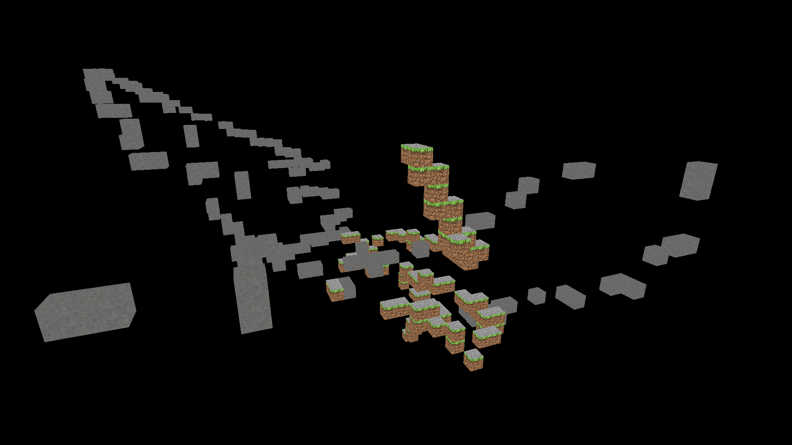

# MinecraftRecreation
Да, это очередной клон Minecraft.



# Прогресс
* Можно ставить блоки левой кнопкой мыши
* Базовая система загрузки/сохранения мира в [world.mcrworld](world.mcrworld) при помощи механизма сериализации
* Движение камеры при зажатии правой кнопки мыши
* Обработка некоторых ошибок
* Два блока: [дёрн](src/main/java/net/minecraftrecreation/world/block/GrassBlock.java) и [камень](src/main/java/net/minecraftrecreation/world/block/Stone.java) ([воздух](src/main/java/net/minecraftrecreation/world/block/Air.java) тоже есть, но он не считается)
* Можно поменять блок, который вы будете ставить в методе input класса [Main](src/main/java/net/minecraftrecreation/client/Main.java).

```jshelllanguage
// Main.java, конец метода input( ... )

if (mouseInput.isLeftButtonPressed()) {
    int x = (int) scene.getCamera().getPosition().x;
    int y = (int) scene.getCamera().getPosition().y;
    int z = (int) scene.getCamera().getPosition().z;

    OVERWORLD.setBlock(STONE, new Location(x,y,z)); // STONE можно заменить на "GrassBlock" и обратно
}
```

# Список дел
* Базовая генерация мира
* Оптимизация рендеринга
* Небо
* Кастомные 3D модели в формате OBJ
* Проверка сталкновений
* Мобы
* Еще больше блоков

# Частота обновлений
Обновления будут выходить каждый день.

# Библиотеки
| Название                                    | Предназначение                                |
|---------------------------------------------|-----------------------------------------------|
| [`LWJGL`](https://lwjgl.org)                | Cамая важная, благодаря ей вся игра работает! |
| [`JOML`](https://github.com/JOML-CI/JOML)   | 3D координаты                                 |
| [`ImGUI`](https://github.com/ocornut/imgui) | Графический интерфейс                         |
